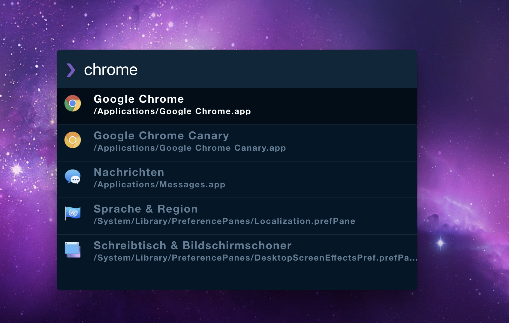

# Zazu Night Owl Theme

[](https://travis-ci.org/chrishelgert/zazu-night-owl-theme)
[](https://greenkeeper.io/)

> A theme based on [Night Owl](https://github.com/sdras/night-owl-vscode-theme) for [Zazu](https://github.com/tinytacoteam/zazu).



## Install

Add `chrishelgert/zazu-night-owl-theme` to your theme block inside your `.zazurc.json` file.

```json
{
  "theme": ["chrishelgert/zazu-night-owl-theme"]
}
```

## Contributing

1. Fork it
2. Create your feature branch
3. Commit your changes
4. Push to the branch
5. Create new Pull Request
